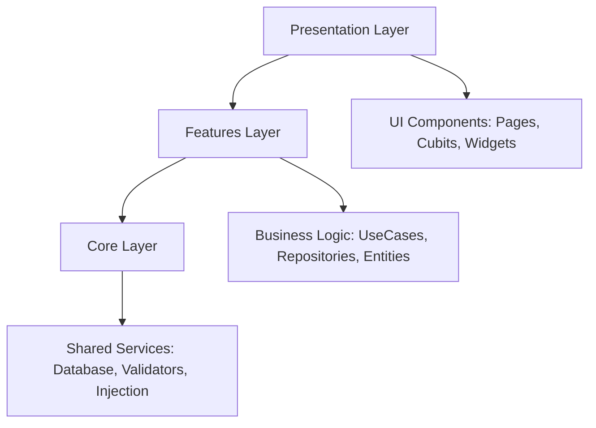
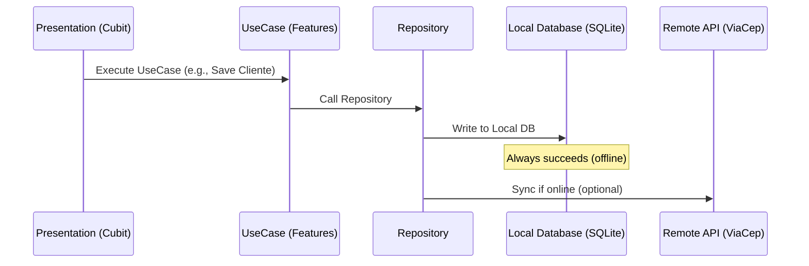
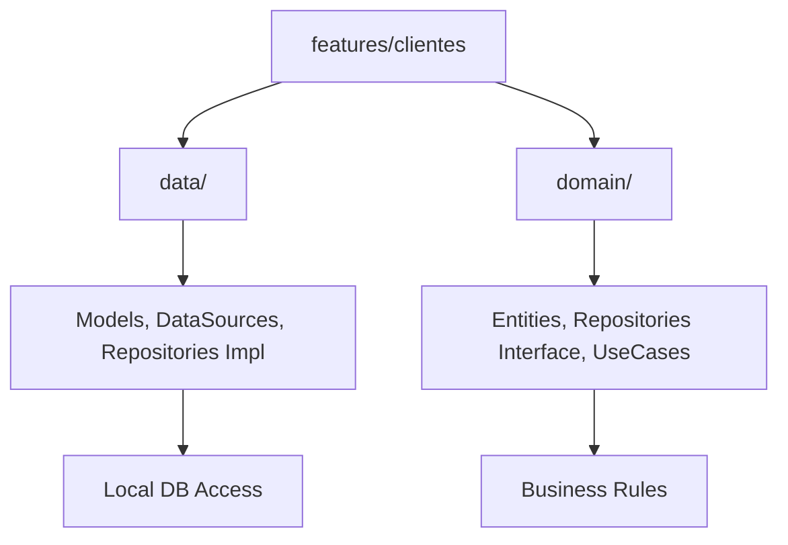

# Cadastro de Clientes - Flutter OfflineFirst com Clean Architecture

##  Vis�o Geral

Este projeto � um **sistema de cadastro de clientes** desenvolvido em Flutter.
A aplica��o foi pensada para operar em modo **offlinefirst**: tudo � lido
e escrito primeiramente no banco local (SQLite) e somente quando h� rede os
dados podem ser sincronizados com servi�os remotos.

A busca de endere�o por CEP utiliza a API externa **ViaCep** para preencher
os campos automaticamente, mas o formul�rio permite que o usu�rio preencha
todos os dados manualmente mesmo que o servi�o esteja indispon�vel.

### O que significa *offlinefirst*?
- A UI permanece responsiva sem conex�o.
- Leituras e grava��es ocorrem no cache/banco local.
- A sincroniza��o com o servidor � opcional e ass�ncrona.
- Melhora a experi�ncia em redes inst�veis.

---

##  Arquitetura do Projeto

A estrutura segue os princ�pios da **Clean Architecture** e est� dividida em
tr�s camadas principais:

1. **Core**  infraestrutura e servi�os compartilhados.
2. **Features**  l�gica de neg�cio dividida por dom�nio (clientes, CEP,
   ramo de atividade, tipo de telefone).
3. **Presentation**  interface do usu�rio e gerenciamento de estado.

Cada camada s� depende das camadas que est�o abaixo dela.

### Camada Core
Respons�vel por tudo que � transversal ao sistema:

- Inje��o de depend�ncias (`GetIt`).
- Banco de dados SQLite (`AppDatabase`).
- Exce��es customizadas (`BusinnesException`).
- Validadores reutiliz�veis (CPF, CNPJ, etc.).

### Camada Features
Cont�m a implementa��o das regras de neg�cio:

- **Entities** e **Models** que representam os dados.
- **Repositories** (interfaces e implementa��es) para acesso a dados.
- **DataSources** locais e remotos.
- **UseCases** que encapsulam a��es espec�ficas.

Cada feature agrupa dom�nio e persist�ncia, mantendo a separa��o de
responsabilidades.

### Camada Presentation
Re�ne tudo relacionado � UI:

- P�ginas (`Pages`) como `ClienteListPage` e `ClienteFormPage`.
- Cubits (`flutter_bloc`) para gerenciar o estado das telas.
- Estados (`States`) que representam carregamento, sucesso e erro.
- Widgets reutiliz�veis para formul�rios, listas e filtros.

---

### Diagrama de Arquitetura



---

##  Fluxo de Depend�ncias

```
Presentation  Features  Core
```

A camada de apresenta��o chama UseCases das features; as features usam
o core para acessar banco, validar dados ou obter depend�ncias.

---

### Diagrama de Fluxo de Dados



---

##  Padr�es Utilizados

- **Cubit Pattern** (`flutter_bloc`) para controle de estado.
- **Repository Pattern** para abstra��o de acesso a dados.
- **UseCase Pattern** para encapsular regras de neg�cio.
- **Dependency Injection** com **GetIt** para montar o grafo de objetos.

---

##  Estrutura de Pastas Comentada

```
lib/
 core/                   # servi�os compartilhados
    database/           # AppDatabase, esquema e migra��es
    exceptions/         # classes de exce��o
    injection/          # configura��o do GetIt
    validator/          # validadores (CPF, CNPJ)
 features/               # dom�nios da aplica��o
    clientes/
       data/           # models, datasources, reposimpl
       domain/         # entities, repositories, usecases
    cep/                # consulta ViaCep
    ramoatividade/
    tipotelefone/
   (cada feature segue o mesmo padr�o)
 presentation/           # UI, cubits, p�ginas, widgets
     cliente_list/
     cliente_form/
```

---

### Diagrama de Estrutura por Feature



---

**Desenvolvido com  usando Clean Architecture e Flutter.**
